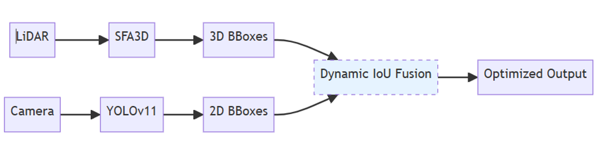
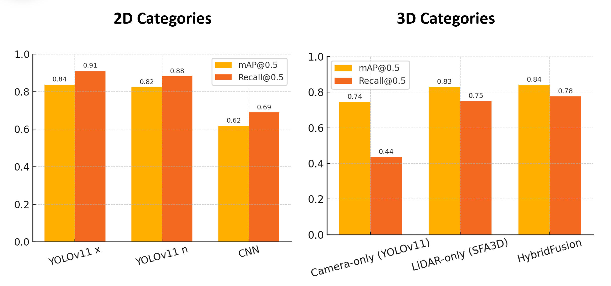
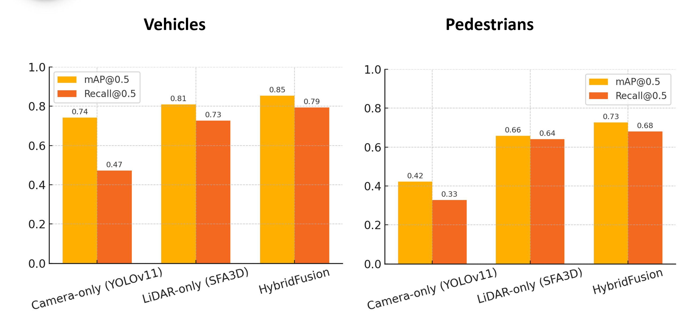

# 面向自动驾驶的目标检测与跟踪系统

本项目基于 CARLA 仿真环境，构建自动驾驶多传感器感知实验系统。系统结合 Camera、LiDAR、YOLOv11 与 SFA3D，实现二维目标检测、三维目标检测与 Camera-LiDAR 融合感知实验。

项目重点在于比较视觉检测、点云检测与多传感器融合方法在自动驾驶场景中的表现，并使用 mAP、Recall 等指标完成评估。

## 系统展示








## 项目结构

```text
.
|-- assets/                  # 图片和演示视频
|-- Carla/                   # CARLA 仿真、传感器与融合实验脚本
|   |-- demos/               # 独立测试脚本
|   |-- pipelines/           # CARLA 在线运行流程
|   |-- tools/               # 数据转换与辅助工具
|   `-- sep/                 # SFA3D 与融合实验入口
`-- Yolo_deepsort_training/  # YOLO / DeepSORT 训练与检测脚本
```

## 模块说明

- `Carla/`：包含 CARLA 0.9.12 下的数据采集、LiDAR/Camera 测试、SFA3D 检测和 YOLO 融合实验。
- `Yolo_deepsort_training/`：包含 YOLO 训练、标注格式转换、视频检测和 DeepSORT 跟踪相关脚本。
- `assets/`：保存系统结构图、实验结果图和演示视频。

## 备注

- CARLA 相关脚本需要配置 CARLA Python API。
- SFA3D 实验默认使用 KITTI 格式数据。
- YOLO/DeepSORT 训练依赖可参考 `Yolo_deepsort_training/requirements.txt`。
